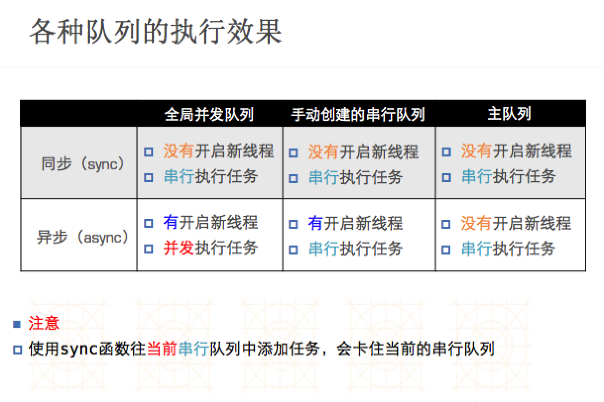

# GCD

##简介

- 纯C语言，提供了非常多强大的函数
- GCD的优势
 - GCD是苹果公司为多核的并行运算提出的解决方案
 - GCD会自动利用更多的CPU内核（比如双核、四核）
 - GCD会自动管理线程的生命周期（创建线程、调度任务、销毁线程）
 - 程序员只需要告诉GCD想要执行什么任务，不需要编写任何线程管理代码
 

###任务和队列

- GCD（就两个核心概念）
 - 任务 ：执行什么操作（耗时操作）（同步异步，是否有能力开线程）
 - 队列：用来存放任务
- GCD的使用就2个步骤
 - 定制任务(确定想做的事情)
 - 将任务添加到队列中
  - GCD会自动将队列中的任务取出，放到对应的线程中执行
  - 任务的取出遵循队列的FIFO原则：先进先出，后进后出

###执行任务

- GCD中有2个用来执行任务的常用函数用同步的方式执行任务

```objc
dispatch_sync(dispatch_queue_t queue, dispatch_block_t block);
//queue：队列
//block：任务

//用异步的方式执行任务
dispatch_async(dispatch_queue_t queue, dispatch_block_t block);
```
- 同步和异步的区别
 - 同步：只能在当前线程中执行任务，不具备开启新线程的能力
 - 异步：可以在新的线程中执行任务，具备开启新线程的能力

###队列的类型
- 并发队列
 - 可以多个任务同时执行
 - 并发只有在异步（dispatch_async）的时候才有效

- 串行队列
  - 任务一个接一个的执行

###容易混淆的术语

- 同步 异步 并发 串行
 - 同步和异步
   * 同步：不能开线程，在当前线程执行
   * 异步：可以在新的线程中执行任务 ，具备开线程的能力
 - 并发和串行（主要影响任务的执行方式）
   * 并发：多个任务同时执行
   * 串行：一个完成之后在执行下一个
 

###并发队列

```objc
//使用dispatch_queue_create函数创建队列
dispatch_queue_t
dispatch_queue_create(const char *label, // 队列名称 
dispatch_queue_attr_t attr); // 队列的类型
使用方法

 // 创建串行队列
    dispatch_queue_t queue = dispatch_queue_create("com.520it.queue", DISPATCH_QUEUE_SERIAL);
    
//创建并发队列
dispatch_queue_t queue = dispatch_queue_create("com.520it.queue", DISPATCH_QUEUE_CONCURRENT);
```
- GCD默认已经提供了全局的并发队列，供整个应用使用，可以无需手动创建

```objc
使用dispatch_get_global_queue函数获得全局的并发队列
dispatch_queue_t dispatch_get_global_queue(
dispatch_queue_priority_t priority, // 队列的优先级
unsigned long flags); // 此参数暂时无用，用0即可

使用

###串行队列
//获得全局并发队列
dispatch_queue_t queue = dispatch_get_global_queue(DISPATCH_QUEUE_PRIORITY_DEFAULT, 0); 

全局并发队列的优先级
#define DISPATCH_QUEUE_PRIORITY_HIGH 2 // 高
#define DISPATCH_QUEUE_PRIORITY_DEFAULT 0 // 默认（中）
#define DISPATCH_QUEUE_PRIORITY_LOW (-2) // 低
#define DISPATCH_QUEUE_PRIORITY_BACKGROUND INT16_MIN // 后台


```
###串行队列
- GCD中获得串行有2种途径
 - 使用dispatch_queue_create函数创建串行队列
 
 ```objc
// 创建串行队列（队列类型传递NULL或者DISPATCH_QUEUE_SERIAL）
dispatch_queue_t queue = dispatch_queue_create("com.520it.queue", NULL); 
```

 - 使用主队列（跟主线程相关联的队列）

 - 主队列是GCD自带的一种特殊的串行队列
    
  - 放在主队列中的任务，都会放到主线程中执行

```objc
  使用dispatch_get_main_queue()获得主队列
  dispatch_queue_t queue = dispatch_get_main_queue();

  ```



###执行任务

- GCD中还有个用来执行任务的函数：
 - dispatch_barrier_async(dispatch_queue_t queue, dispatch_block_t block);
 - 在前面的任务执行结束后它才执行，而且它后面的任务等它执行完成之后才会执行

```objc

- (void)barrier
{
    dispatch_queue_t queue = dispatch_queue_create("12312312", DISPATCH_QUEUE_CONCURRENT);
    
    dispatch_async(queue, ^{
        NSLog(@"----1-----%@", [NSThread currentThread]);
    });
    dispatch_async(queue, ^{
        NSLog(@"----2-----%@", [NSThread currentThread]);
    });
    dispatch_barrier_async(queue, ^{
        NSLog(@"----barrier-----%@", [NSThread currentThread]);
    });
    dispatch_async(queue, ^{
        NSLog(@"----3-----%@", [NSThread currentThread]);
    });
    dispatch_async(queue, ^{
        NSLog(@"----4-----%@", [NSThread currentThread]);
    });
}


```
###线程间通信示例

- 从子线程回到主线程

```objc
dispatch_async(
dispatch_get_global_queue(DISPATCH_QUEUE_PRIORITY_DEFAULT, 0), ^{
    // 执行耗时的异步操作...
      dispatch_async(dispatch_get_main_queue(), ^{
        // 回到主线程，执行UI刷新操作
        });
});

```

### 其他用法

```objc
1.iOS常见的延时执行
调用NSObject的方法
[self performSelector:@selector(run) withObject:nil afterDelay:2.0];
// 2秒后再调用self的run方法

2.使用GCD函数
dispatch_after(dispatch_time(DISPATCH_TIME_NOW, (int64_t)(2.0 * NSEC_PER_SEC)), dispatch_get_main_queue(), ^{
    // 2秒后异步执行这里的代码...
});

3.使用NSTimer
[NSTimer scheduledTimerWithTimeInterval:2.0 target:self selector:@selector(test) userInfo:nil repeats:NO];


```

### 一次性代码


```objc
使用dispatch_once函数能保证某段代码在程序运行过程中只被执行1次
static dispatch_once_t onceToken;
dispatch_once(&onceToken, ^{
    // 只执行1次的代码(这里面默认是线程安全的)
});

```


### 定时器

```objc
// 创建Timer
self.timer = dispatch_source_create(DISPATCH_SOURCE_TYPE_TIMER, 0, 0, dispatch_get_main_queue());
// 设置定时器的触发时间（1秒后）和时间间隔（每隔2秒）
dispatch_source_set_timer(self.timer, dispatch_time(DISPATCH_TIME_NOW, 1 * NSEC_PER_SEC), 2 * NSEC_PER_SEC, 0);
// 设置回调
dispatch_source_set_event_handler(self.timer, ^{
    NSLog(@"Timer %@", [NSThread currentThread]);
});
// 开始定时器
dispatch_resume(self.timer);

//取消定时器
dispatch_cancel(self.timer);
self.timer = nil;


```

### 快速迭代


```objc
使用dispatch_apply函数能进行快速迭代遍历
dispatch_apply(10, dispatch_get_global_queue(0, 0), ^(size_t index){
    // 执行10次代码，index顺序不确定
});

/**
 * 快速迭代~文件剪切
 */
- (void)apply
{
    dispatch_queue_t queue = dispatch_get_global_queue(DISPATCH_QUEUE_PRIORITY_DEFAULT, 0);
    NSString *from = @"/Users/xiaomage/Desktop/From";
    NSString *to = @"/Users/xiaomage/Desktop/To";
    
    NSFileManager *mgr = [NSFileManager defaultManager];
    NSArray *subpaths = [mgr subpathsAtPath:from];
    
    dispatch_apply(subpaths.count, queue, ^(size_t index) {
        NSString *subpath = subpaths[index];
        NSString *fromFullpath = [from stringByAppendingPathComponent:subpath];
        NSString *toFullpath = [to stringByAppendingPathComponent:subpath];
        // 剪切
        [mgr moveItemAtPath:fromFullpath toPath:toFullpath error:nil];
        
        NSLog(@"%@---%@", [NSThread currentThread], subpath);
    });
}

```


### 队列组

- 有这么1种需求
 - 首先：分别异步执行2个耗时的操作
 - 其次：等2个异步操作都执行完毕后，再回到主线程执行操作

- 如果想要快速高效地实现上述需求，可以考虑用队列组

```objc

  dispatch_group_t group =  dispatch_group_create();
  dispatch_group_async(group,      dispatch_get_global_queue(DISPATCH_QUEUE_PRIORITY_DEFAULT, 0), ^{
    // 执行1个耗时的异步操作
});
dispatch_group_async(group, dispatch_get_global_queue(DISPATCH_QUEUE_PRIORITY_DEFAULT, 0), ^{
    // 执行1个耗时的异步操作
});
dispatch_group_notify(group, dispatch_get_main_queue(), ^{
    // 等前面的异步操作都执行完毕后，回到主线程...
});

//用法
- (void)group
{
    
    dispatch_queue_t queue = dispatch_get_global_queue(DISPATCH_QUEUE_PRIORITY_DEFAULT, 0);
    // 创建一个队列组
    dispatch_group_t group = dispatch_group_create();
    
    // 1.下载图片1
    dispatch_group_async(group, queue, ^{
        // 图片的网络路径
        NSURL *url = [NSURL URLWithString:@"http://img.pconline.com.cn/images/photoblog/9/9/8/1/9981681/200910/11/1255259355826.jpg"];
        
        // 加载图片
        NSData *data = [NSData dataWithContentsOfURL:url];
        
        // 生成图片
        self.image1 = [UIImage imageWithData:data];
    });
    
    // 2.下载图片2
    dispatch_group_async(group, queue, ^{
        // 图片的网络路径
        NSURL *url = [NSURL URLWithString:@"http://pic38.nipic.com/20140228/5571398_215900721128_2.jpg"];
        
        // 加载图片
        NSData *data = [NSData dataWithContentsOfURL:url];
        
        // 生成图片
        self.image2 = [UIImage imageWithData:data];
    });
    
    // 3.将图片1、图片2合成一张新的图片
    dispatch_group_notify(group, queue, ^{
        // 开启新的图形上下文
        UIGraphicsBeginImageContext(CGSizeMake(100, 100));
        
        // 绘制图片
        [self.image1 drawInRect:CGRectMake(0, 0, 50, 100)];
        [self.image2 drawInRect:CGRectMake(50, 0, 50, 100)];
        
        // 取得上下文中的图片
        UIImage *image = UIGraphicsGetImageFromCurrentImageContext();
        
        // 结束上下文
        UIGraphicsEndImageContext();
        
        // 回到主线程显示图片
        dispatch_async(dispatch_get_main_queue(), ^{
            // 4.将新图片显示出来 
            self.imageView.image = image;
        });
    });
}

```

### 单例模式
 - 单例作用
   - 保证程序运行过程中，一个类只有一个实例，而且只实例化一次
   - 方便控制实例个数，并节约资源
 - 使用场合： 整个应用程序中共享一份资源（该资源只需创建时实例化一次）
 
 - ARC中，单例模式的实现


```objc
1.在.m中保留一个全局的static的实例
static id _instance;
重写allocWithZone:方法，在这里创建唯一的实例（注意线程安全）
+ (instancetype)allocWithZone:(struct _NSZone *)zone
{
    static dispatch_once_t onceToken;
    dispatch_once(&onceToken, ^{
        _instance = [super allocWithZone:zone];
    });
    return _instance;
}

2.提供1个类方法让外界访问唯一的实例
+ (instancetype)sharedInstance
{
    static dispatch_once_t onceToken;
    dispatch_once(&onceToken, ^{
        _instance = [[self alloc] init];
    });
    return _instance;
}

3.实现copyWithZone:方法
- (id)copyWithZone:(struct _NSZone *)zone
{
    return _instance;
}

```

### 抽成宏定义

```objc
// .h文件
#define XMGSingletonH(name) + (instancetype)shared##name;

// .m文件
#define XMGSingletonM(name) \
static id _instance; \
 \
+ (instancetype)allocWithZone:(struct _NSZone *)zone \
{ \
    static dispatch_once_t onceToken; \
    dispatch_once(&onceToken, ^{ \
        _instance = [super allocWithZone:zone]; \
    }); \
    return _instance; \
} \
 \
+ (instancetype)shared##name \
{ \
    static dispatch_once_t onceToken; \
    dispatch_once(&onceToken, ^{ \
        _instance = [[self alloc] init]; \
    }); \
    return _instance; \
} \
 \
- (id)copyWithZone:(NSZone *)zone \
{ \
    return _instance; \
}

```


### 非GCD方法的单例

```objc

static id _instance;

+ (instancetype)allocWithZone:(struct _NSZone *)zone
{
    @synchronized(self) {
        if (_instance == nil) {
            _instance = [super allocWithZone:zone];
        }
    }
    return _instance;
}

+ (instancetype)sharedInstance
{
    @synchronized(self) {
        if (_instance == nil) {
            _instance = [[self alloc] init];
        }
    }
    return _instance;
}

- (id)copyWithZone:(NSZone *)zone
{
    return _instance;
}

```


链接：http://pan.baidu.com/s/1skXvJvn


