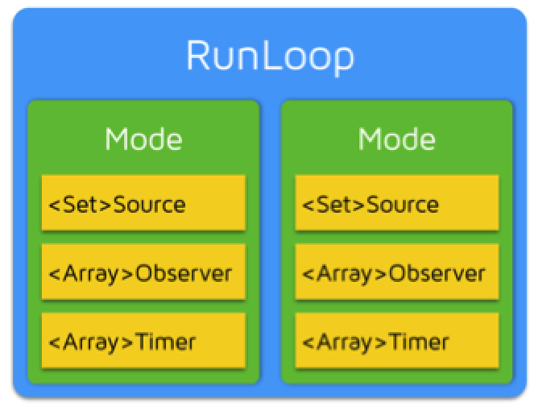

# RunLoop


## 作用

- 1.程序一直活着  runloop作用
2. 处理app中的各种事件（触摸，定时 刷新）
3. 节省cup资源 提高程序性能  
4. 如果没有runloop 程序刚启动就会推出


### 1.什么是runloop
- 运行循环其实内部就是 do -while 循环，在这个循环的内部不断的处理各种任务
- 一个线程对应一个runloop
- 主线程的runloop默认启动，
- 子线程手动启动
- runloop只能选择一个mode启动，如果mode中没有source，timer，observe（同时没有） 会自动退出


### 2.开发过程中怎么使用runloop

- 让一个子线程不进入消亡状态，等待其他线程发来的消息
- 在子线程中开启一个定时器
- 在子线程中长期监控一些行为
- 可以控制定时器在那种模式下运行
- 可以让某些事件在特定模式下执行
- 可以添加observe 监听runloop的状态，比如点击事件的处理，可以在点击事件之前处理一些事情


### RunLoop对象

- ios中有两套API来访问和使用 Runlooop
  - Foundation 里的  NSRunLoop
  - Core Foundation 里的 CFRunLoop
  
 - NSRunLoop和CFRunLoopRef都代表着RunLoop对象
 - NSRunLoop是基于CFRunLoopRef的一层OC包装，所以要了解RunLoop内部结构，需要多研究CFRunLoopRef层面的API（Core Foundation层面）


### RunLoop资料

苹果官方文档
https://developer.apple.com/library/mac/documentation/Cocoa/Conceptual/Multithreading/RunLoopManagement/RunLoopManagement.html

CFRunLoopRef是开源的
http://opensource.apple.com/source/CF/CF-1151.16/


### RunLoop与线程

- 每条线程都有唯一的一个与之对应的RunLoop对象

- 主线程的RunLoop已经自动创建好了，子线程的RunLoop需要主动创建

- RunLoop在第一次获取时创建，在线程结束时销毁


### 获得RunLoop对象

```objc
Foundation
[NSRunLoop currentRunLoop]; // 获得当前线程的RunLoop对象
[NSRunLoop mainRunLoop]; // 获得主线程的RunLoop对象

Core Foundation
CFRunLoopGetCurrent(); // 获得当前线程的RunLoop对象
CFRunLoopGetMain(); // 获得主线程的RunLoop对象

```

### RunLoop相关类

 - Core Foundation中关于RunLoop的5个类
  - CFRunLoopRef
  - CFRunLoopModeRef

    * CFRunLoopModeRef代表RunLoop的运行模式
    * 一个 RunLoop 包含若干个 Mode，每个Mode又包含若干个Source/Timer/Observer
    * 每次RunLoop启动时，只能指定其中一个 Mode，这个Mode被称作 CurrentMode
    * 如果需要切换Mode，只能退出Loop，再重新指定一个Mode进入
    * 这样做主要是为了分隔开不同组的Source/Timer/Observer，让其互不影响
    * 
    * 系统默认注册了5个Mode:
    * kCFRunLoopDefaultMode：App的默认Mode，通常主线程是在这个Mode下运行
    * UITrackingRunLoopMode：界面跟踪 Mode，用于 ScrollView 追踪触摸滑动，保证界面滑动时不受其他 Mode 影响
    * UIInitializationRunLoopMode: 在刚启动 App 时第进入的第一个 Mode，启动完成后就不再使用
    * GSEventReceiveRunLoopMode: 接受系统事件的内部 Mode，通常用不到
    * kCFRunLoopCommonModes: 这是一个占位用的Mode，不是一种真正的Mode
   - CFRunLoopSourceRef
    * CFRunLoopSourceRef是事件源（输入源）
    * 以前的分法
    
         1.Port-Based Sources 基于端口 通过内核发过来的
         
         2.Custom Input Sources  自定义输入源
         
         3.Cocoa Perform Selector Sources    
    * 现在的分法
     
         
         1.Source0：非基于Port的
         
         2.Source1：基于Port的  通过其他线程/内核，过来的事件
     
  
   -  - CFRunLoopTimerRef
        * CFRunLoopTimerRef是基于时间的触发器
        * CFRunLoopTimerRef是基于时间的触发器


  - - CFRunLoopObserverRef

      * CFRunLoopObserverRef是观察者，能够监听RunLoop的状态改变

      * 可以监听的时间点有以下几个


CF的内存管理 （Core Foundation）  
1.凡是带有create， copy retain等字眼的都需要release  
2.release函数   CFRelease(observer);   

```objc
typedef CF_OPTIONS(CFOptionFlags, CFRunLoopActivity) {
    kCFRunLoopEntry = (1UL << 0),    //1 
    kCFRunLoopBeforeTimers = (1UL << 1), //2
    kCFRunLoopBeforeSources = (1UL << 2),//4     
    kCFRunLoopBeforeWaiting = (1UL << 5),//32
    kCFRunLoopAfterWaiting = (1UL << 6),//64
    kCFRunLoopExit = (1UL << 7),//128
    kCFRunLoopAllActivities = 0x0FFFFFFFU
};
(1UL << 0)就是2的几次方
```


### RunLoop应用

 - NSTimer
 - ImageView显示
 - PerformSelector
 - 常驻线程
 - 自动释放池


### RunLoop 实例应用1.

```objc
 NSTimer *timer = [NSTimer timerWithTimeInterval:2.0 target:self selector:@selector(run) userInfo:nil repeats:YES];
    // 定时器只运行在NSDefaultRunLoopMode下，一旦RunLoop进入其他模式，这个定时器就不会工作
    [[NSRunLoop currentRunLoop] addTimer:timer forMode:NSDefaultRunLoopMode];
    // 定时器会跑在标记为common modes的模式下
    // 标记为common modes的模式：UITrackingRunLoopMode和kCFRunLoopDefaultMode
    [[NSRunLoop currentRunLoop] addTimer:timer forMode:NSRunLoopCommonModes];
    
```
- 结论1 ：NSRunLoopCommonModes模式下包括UITrackingRunLoopMode和kCFRunLoopDefaultMode

- 结论2： 在视图滑动时如果还要继续做一些事情可以借鉴次操作


### RunLoop 实例应用2.

```objc
- (void)timer2
{
    // 调用了scheduledTimer返回的定时器，已经自动被添加到当前runLoop中，而且是NSDefaultRunLoopMode
    NSTimer *timer = [NSTimer scheduledTimerWithTimeInterval:2.0 target:self selector:@selector(run) userInfo:nil repeats:YES];
    
    // 修改runloop的mode模式
    [[NSRunLoop currentRunLoop] addTimer:timer forMode:NSRunLoopCommonModes];
}

2.监听runloop的状态
- (void)observer
{
    // 创建observer
    CFRunLoopObserverRef observer = CFRunLoopObserverCreateWithHandler(CFAllocatorGetDefault(), kCFRunLoopAllActivities, YES, 0, ^(CFRunLoopObserverRef observer, CFRunLoopActivity activity) {
        
        NSLog(@"----监听到RunLoop状态发生改变---%zd", activity);
    });

    // 添加观察者：监听RunLoop的状态
    CFRunLoopAddObserver(CFRunLoopGetCurrent(), observer, kCFRunLoopDefaultMode);
    
    // 释放Observer
    CFRelease(observer);
}

```
 
 - 总结： 可以通过 activity的数值（数值参考上文typedef CF_OPTIONS ）来进行一些其他操作，比如事件处理前要做一些事情。。。

###在子线程创建runloop（永远不死）

```objc
- (void)viewDidLoad {
    [super viewDidLoad];
    
    self.thread = [[XMGThread alloc] initWithTarget:self selector:@selector(run) object:nil];
    [self.thread start];
}

- (void)run
{
    NSLog(@"----------run----%@", [NSThread currentThread]);
    
    while (1) {
        [[NSRunLoop currentRunLoop] run];
    }
    
    NSLog(@"---------");
}

2,
- (void)useImageView
{
    // 只在NSDefaultRunLoopMode模式下显示图片
    [self.imageView performSelector:@selector(setImage:) withObject:[UIImage imageNamed:@"placeholder"] afterDelay:3.0 inModes:@[NSDefaultRunLoopMode]];
    //可以查看runloop中是否被加入值
 NSLog(@"%@", [NSRunLoop currentRunLoop]);
}


```
 
 - run方法的最后一个NSLog永远不会打出，所以证明开启runloop成功
 - 可以随时让这个线程做一些其他事情
 - 2,中可在视图滚动时暂时不显示图片，提高流畅度
 - 
### GCD 定时器

 - GCD的定时器不受runloop的mode影响


```objc
/** 定时器(这里不用带*，因为dispatch_source_t就是个类，内部已经包含了*) */
@property (nonatomic, strong) dispatch_source_t timer;
int count = 0;
- (void)touchesBegan:(NSSet *)touches withEvent:(UIEvent *)event
{
    // 获得队列
//    dispatch_queue_t queue = dispatch_get_global_queue(0, 0);
    dispatch_queue_t queue = dispatch_get_main_queue();
    
    // 创建一个定时器(dispatch_source_t本质还是个OC对象)
    self.timer = dispatch_source_create(DISPATCH_SOURCE_TYPE_TIMER, 0, 0, queue);
    
    // 设置定时器的各种属性（几时开始任务，每隔多长时间执行一次）
    // GCD的时间参数，一般是纳秒（1秒 == 10的9次方纳秒）
    // 何时开始执行第一个任务
    // dispatch_time(DISPATCH_TIME_NOW, 1.0 * NSEC_PER_SEC) 比当前时间晚3秒
    dispatch_time_t start = dispatch_time(DISPATCH_TIME_NOW, (int64_t)(1.0 * NSEC_PER_SEC));
    uint64_t interval = (uint64_t)(1.0 * NSEC_PER_SEC);
    dispatch_source_set_timer(self.timer, start, interval, 0);
    
    // 设置回调
    dispatch_source_set_event_handler(self.timer, ^{
        NSLog(@"------------%@", [NSThread currentThread]);
        count++;
        
        if (count == 4) {
            // 取消定时器
            dispatch_cancel(self.timer);
            self.timer = nil;
        }
    });
    
    // 启动定时器
    dispatch_resume(self.timer);
}

```
###关于自动释放池

 - 自动释放池  runloop 睡觉的时候回释放一次（BeforeWaiting）
   睡醒之后立刻在建一下自动释放池
   
   资料链接 ：http://pan.baidu.com/s/1dEOqN0t


